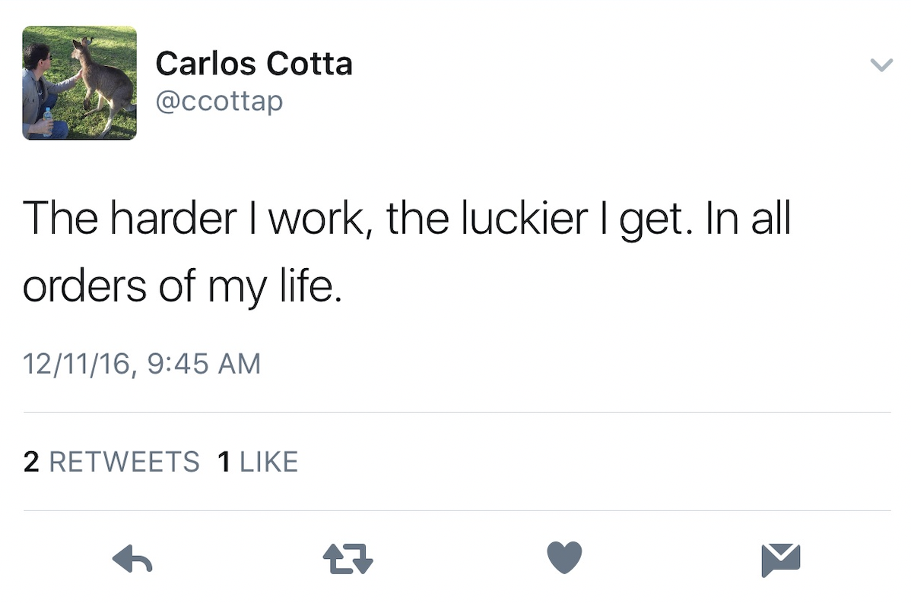
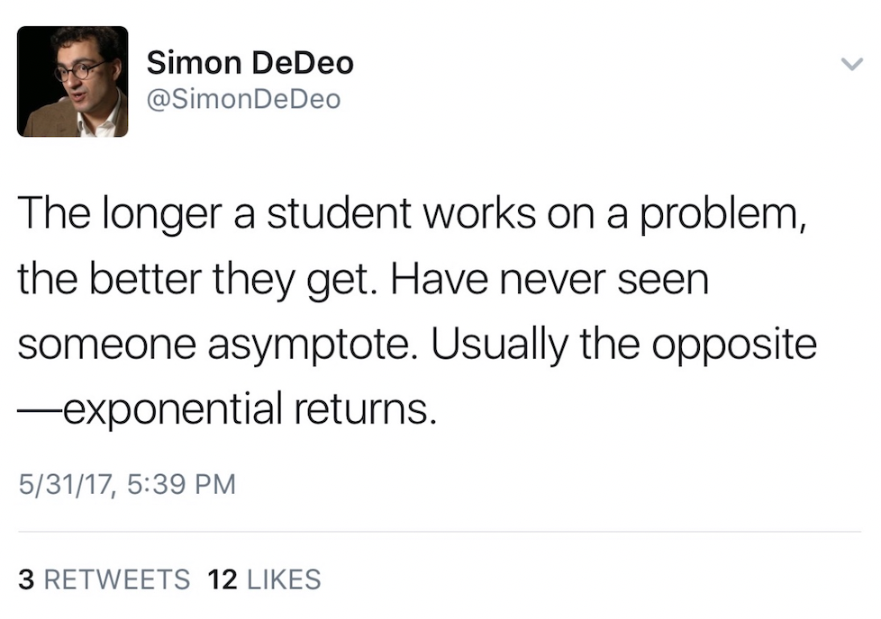
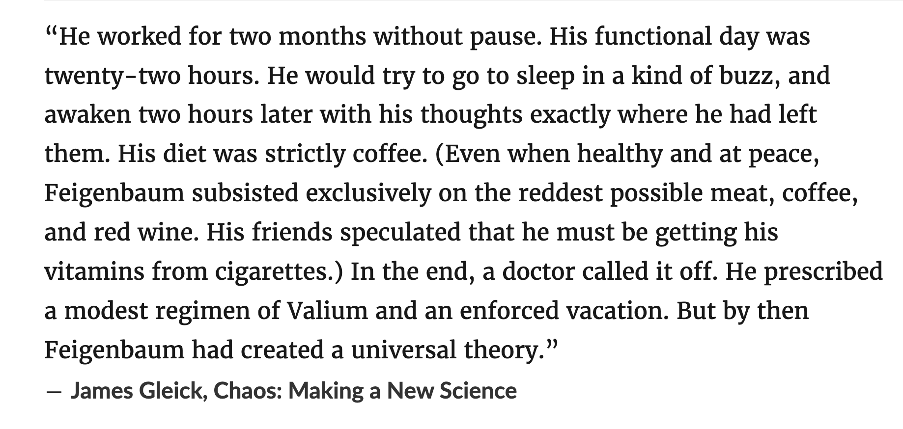

# a-list-of-things-that-feel-good

 i get this feeling ... i get what that must feel like haha

* driving to get coffee
  * extra points if the weather is like 70s-80s
  * extra points if its after it rained and the sun is setting so theres the reflection on the road of the sun setting, its nice, its a nj thing i think

* going to the gym
  * watching older and younger people work out is pretty motivating actually
 
* having a years worth of a good habit, even a decades long habit, become useful in a random moment feels pretty good

* being in the pool when the outside temperature is like 95-100 degrees (i know it sucks for everyone else but) its so nice when its that hot outside, didnt have too many super hot days this summer but previous summers mmmmm its so nice

* rewatching (we've seen this movie SO MANY TIMES since we saw it in theaters) prometheus (2012) greatest movie ever like the whole thing, everything about it, 10/10 movie, we rewatch it when theres nothing to do like a couple of weeks ago

* **figuring something out feels good**

* getting my eyebrows done, the lady who does it, i tip her well bc nobody can do it like she can, she just knows what to do and she does it quickly

* haircut/highlights/lip filler/nails 10/10 totes recommend a little time consuming sometimes and u have to bring a good story to share with the person thats doing the service i dunno but feels great afterwards

* thinking ... in a quiet place about something productive, i can do this for hours, i love this thing about myself

* reading something productive feels good

* having particular experience on my CV (e.g. synthetic biology, cancer genomics) become useful for the (hopefully near) future --> amazing, amazing feeling

* me ... i feel good
